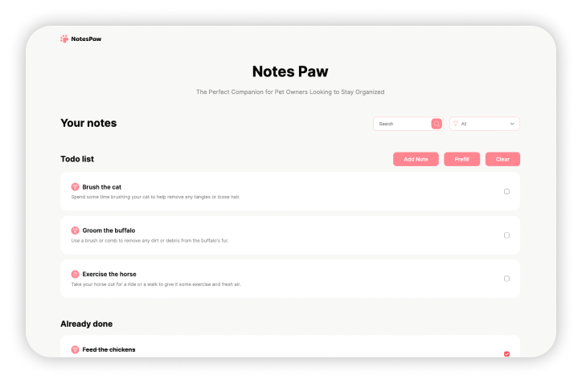

<div align="center">
    <h1>
       Notes Paw
    </h1>
    <p>
      Welcome to "Notes Paw" Todo App - a React application built with the Vite bundler, designed to showcase how UI kits can be used in practice. Our app is intended to serve as an educational example for students to learn how UI components can be used to build real-world applications with React.
    <p>
    
</div>


## Getting started

To get started with "Notes Paw" Todo App, follow these steps:

1. Clone this repository to your local machine:

```bash
git clone https://github.com/wallwhite/notes-paw-app.git
```

2. Install the dependencies:

```bash
cd notes-paw-app

yarn install
```

3. Run the development server:

```bash
yarn dev
```

This will start a local development server at `http://localhost:5173`, where you can view the app in your browser. The app includes a simple UI for managing todo lists related to pets.

## UI Kit

This project uses the "paw-ui" library as a UI kit. The library includes a collection of React components specifically designed for pet-related applications. You can find more information about the library and its usage in the project's documentation.

## Contributing

This project is intended for educational purposes only and contributions are not necessary.

## License

"Notes Paw" Todo App is licensed under the MIT license. See [LICENSE](./LICENSE) for more information.